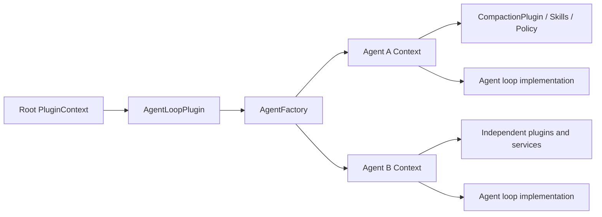

<div align="center">
  <picture>
    <source media="(prefers-color-scheme: dark)" srcset="docs/assets/axisagentic-logo-dark.svg">
    <source media="(prefers-color-scheme: light)" srcset="docs/assets/axisagentic-logo-light.svg">
    
  </picture>

  <p>
    <strong>English</strong> ·
    <a href="README.zh-CN.md">简体中文</a>
  </p>

  <p>
    <a href="https://github.com/yshenaw/DeepSeek-Harness-AxisAgentic/actions/workflows/ci.yml"></a>
    
    <a href="https://github.com/astral-sh/ruff"></a>
    <a href="LICENSE"></a>
    <a href="CONTRIBUTING.md"></a>
  </p>

  <p>
    <a href="https://xyz-lab.ai">XYZ AI Lab</a> ·
    <a href="https://xyz-lab.ai/blogs/ai4ai-at-scale/">Technical Report</a>
  </p>
</div>

AxisAgentic is an extensible runtime for long-horizon AI agents. It also collects the trajectories produced during execution. The runtime works with OpenAI-compatible endpoints and pluggable local model clients, and handles multi-turn execution, tool orchestration, context management, recovery, and benchmark evaluation. Each trace preserves the state visible to the model, so the same record can support recovery and replay, benchmark evaluation, or filtered SFT export.

Web Search and WideSearch are the current reference recipes. The same extension points can support domain, general-purpose, and coding agents. This repository does not include model weights.

> [!IMPORTANT]
> **Fork and experiment.** This repository is derived from [XYZ-AI-Lab/AxisAgentic](https://github.com/XYZ-AI-Lab/AxisAgentic), which remains the upstream source of the retained runtime, recipes, documentation, attribution, and citation. This fork explores a DeepSeek Harness-inspired **“everything is plugin”** composition model through small, compatibility-preserving changes. It does not claim compatibility with DeepSeek Harness or that the complete AxisAgentic runtime is already plugin-based.

## 🧩 Experimental plugin composition

The goal of this fork is to make future Harness, agent-loop, skill, and context-management changes easier without rewriting the existing runtime. The experimental layer currently adds:

- **Owned lifecycle:** `PluginContext` owns scoped services and cleanup effects. Failed setup rolls back, explicit unmount is idempotent, and context shutdown disposes effects in reverse registration order.
- **Reversible registration:** tool and argument-repair-hook registration return disposers, so plugin-owned capabilities can be removed safely.
- **Pluggable agent loops:** `AgentLoopPlugin` provides an `AgentFactory`; every created agent receives an independent `PluginContext` for its own model, tools, policy, and supporting services.
- **Pluggable compaction:** `CompactionPlugin` provides a `Compactor` in an agent-local context. `WebSearchTaskOrchestrator` consumes the interface rather than a concrete compression manager.



The boundary is intentionally narrow. `ConversationRuntime`, `TaskOrchestrator`, model clients, trace formats, configuration, and the existing Web Search/WideSearch runner assembly remain compatible with the upstream design. Dependency-gated activation, hot provider replacement, a general event bus, long-term memory, and full recipe plugin composition are not implemented yet.

### AI4AI: external-agent-driven Harness evolution

In this project, **AI4AI** means using an external development agent—such as Claude Code, Codex, or Copilot—to evolve the AxisAgentic Harness. The external agent can inspect source code, replay traces, analyze benchmark results, implement candidate changes, and run regression or cost comparisons. AxisAgentic supplies the scoped, reversible, and testable boundaries that make this process controlled.

```text
Observe code, traces, and metrics
-> propose a Harness change
-> implement a candidate plugin/profile
-> run tests and benchmarks
-> compare with the baseline
-> human review
-> promote or roll back
```

Plugin composition helps this workflow because it turns a Harness change into a smaller evolution unit:

- **Smaller change surface:** an external agent can replace one loop, skill, policy, or compactor without rewriting the central orchestrator.
- **Candidate isolation:** baseline and candidate agents can use different plugin contexts in the same evaluation process without sharing mutable services.
- **Reproducible comparison:** a candidate can be described as a concrete plugin/profile composition and evaluated against the same datasets, traces, and metrics.
- **Cheap rollback:** reversible registration and owned cleanup allow a failed candidate to be removed without leaving tools, hooks, or resources behind.
- **Safer promotion:** the development agent produces a candidate change; tests, benchmarks, code review, and explicit promotion decide whether it becomes part of the stable Harness.

This is **AI-assisted, controlled Harness evolution**, not unrestricted runtime self-modification. External agents do not automatically gain production authority, and runtime experiments are not promoted without source changes, validation, and review. Plugins are therefore not the end goal: they are the smallest practical units for Harness changes that need to be isolated, measured, and reversed.

<details>
<summary>Minimal runnable composition example</summary>

```python
import asyncio
from typing import Any, cast

from agentic import AGENT_FACTORY_SERVICE, AgentFactory, AgentLoopPlugin, PluginContext


class LabelPlugin:
  def __init__(self, label: str) -> None:
    self._label = label

  def apply(self, context: PluginContext) -> None:
    context.provide("label", self._label)


class EchoLoop:
  def __init__(self, context: PluginContext) -> None:
    self._label = cast("str", context.require("label"))

  async def run(
    self,
    task: str | dict[str, Any],
    task_id: str | None = None,
    *,
    extra_trace_metadata: dict[str, Any] | None = None,
  ) -> str:
    del task_id, extra_trace_metadata
    return f"{self._label}: {task}"


async def main() -> None:
  async with PluginContext() as root:
    await root.mount(AgentLoopPlugin(EchoLoop))
    factory = cast("AgentFactory", root.require(AGENT_FACTORY_SERVICE))

    async def setup(context: PluginContext) -> None:
      await context.mount(LabelPlugin("agent-1"))

    agent = await factory.create_agent(setup=setup)
    print(await agent.run("hello"))  # agent-1: hello


asyncio.run(main())
```

To switch compaction strategies, implement the `Compactor` protocol and mount `CompactionPlugin(your_compactor)` in the agent setup. The loop can then resolve it through `COMPACTION_SERVICE` without depending on the concrete implementation.

</details>

## ✨ Core capabilities

- Append-only traces preserve runtime events and reconstruct the context visible to the model at any stage.
- Model clients, tools, orchestrators, datasets, evaluators, reward functions, and recipe policies are replaceable.
- Context budgets, compaction, rollback, retries, recovery, self-verification, and tool limits support long runs.
- Each task records traces, token and timing metrics, evaluation artifacts, and provenance for trajectory selection.
- SFT exporters replay runtime visibility markers, while rollout interfaces connect execution to external training systems.
- Strict YAML schemas and portable path schemes keep runs reproducible across environments.

## 🔁 From execution to learning

Every task writes an append-only trace. The trace is the common source for replay, evaluation, and trajectory collection. Selected trajectories can then be exported for external training.

<picture>
  <source media="(prefers-color-scheme: dark)" srcset="docs/assets/axisagentic-execution-learning-loop-dark.svg">
  <source media="(prefers-color-scheme: light)" srcset="docs/assets/axisagentic-execution-learning-loop-light.svg">
  
</picture>

Runtime markers record rollback, context compaction, and discard-all events. Replaying them reconstructs what the model saw at a given stage. Trace inspection and SFT export use the same rules, so supervised examples exclude hidden history and rolled-back actions.

Recipe exporters emit Swift Agent and related training formats with the source trace, task status, and optional metadata. The external training pipeline owns final correctness filters, loss masks, and optimization. AxisAgentic supplies the replay and export boundary so inference and training use the same interaction history.

## 🦅 Flagship reference: XYZ-Aquila

XYZ-Aquila is a search system built with AxisAgentic. Its recipe combines search and scraping with context management, recovery, evaluation, and state-faithful SFT export. The underlying interfaces also work with other model clients, tools, and task domains.

### 📊 Results

The [Aquila technical report](https://xyz-lab.ai/blogs/ai4ai-at-scale/) reports XYZ-Aquila-mini and XYZ-Aquila-pro across seven agentic benchmarks. The figure below reproduces the reported comparisons for six of them.


*Metrics: BrowseComp, BrowseComp-ZH, LiveBrowseComp, and Humanity's Last Exam use LLM-judge accuracy; DeepSearchQA uses macro F1; WideSearch uses item-level F1 Max@4. See [Evaluation and reproducibility](docs/evaluation.md) for details.*

Some baseline values come from public reports with different harnesses, tools, judges, and evaluation dates. Treat the figure as a benchmark-level comparison rather than a controlled universal ranking.

## 🚀 Get started

AxisAgentic requires Python 3.12 or newer and an OpenAI-compatible model endpoint. [Getting started](docs/getting-started.md) covers installation, provider variables, recipe configuration, dry runs, replay, and SFT export. See [Configuration](docs/configuration.md) for the full configuration reference.

```bash
git clone https://github.com/yshenaw/DeepSeek-Harness-AxisAgentic.git
cd DeepSeek-Harness-AxisAgentic
python3.12 -m venv .venv
source .venv/bin/activate
./setup_env.sh
source .envs/axis_agentic_env.sh
cp .env.example .envs/.env
```

After setting the provider and dataset values, validate the Web Search recipe without starting a run:

```bash
cp recipe/web_search/configs/default.yaml my-search-run.yaml
python -m recipe.web_search.runners.run_eval_config \
  --config my-search-run.yaml \
  --dry-run
```

## 📚 Documentation

- [Documentation index](docs/README.md)
- [Getting started](docs/getting-started.md)
- [Configuration](docs/configuration.md)
- [Architecture](docs/architecture.md)
- [Project structure](docs/project-structure.md)
- [Evaluation and reproducibility](docs/evaluation.md)
- [Recipes](recipe/README.md)

## 🤝 Contributing

The [contributing guide](CONTRIBUTING.md) covers development setup and required checks. Contributors must follow the [Code of Conduct](CODE_OF_CONDUCT.md). Report vulnerabilities through the [security policy](SECURITY.md).

## 📜 License

Unless otherwise noted, AxisAgentic is licensed under the [Apache License 2.0](LICENSE). See [NOTICE](NOTICE) for third-party attribution and licensing notes.

## 📝 Upstream citation

For the retained AxisAgentic implementation, cite the upstream software as follows:

```bibtex
@software{wang2026axisagentic,
  author       = {Wang, Jinyu and Zhang, Yifei and {{XYZ Agentic Team}}},
  title        = {AxisAgentic: An Extensible Runtime and Trajectory-Collection Framework for Long-Horizon Agents},
  organization = {XYZ AI Lab},
  year         = {2026},
  url          = {https://github.com/XYZ-AI-Lab/AxisAgentic}
}
```
